

Riverbed
---
<!--  -->
<!-- <iframe src="../images/Riverbed.gif"> -->
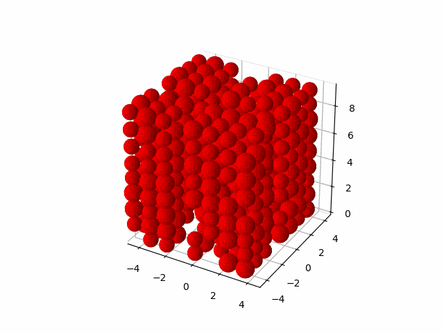
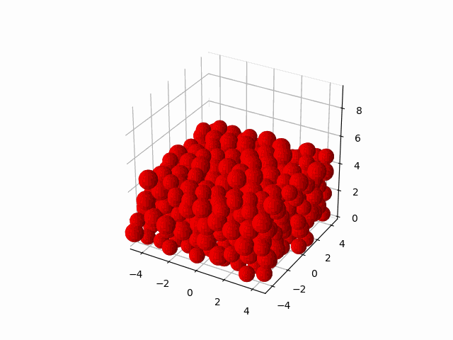

Light Vortex
---
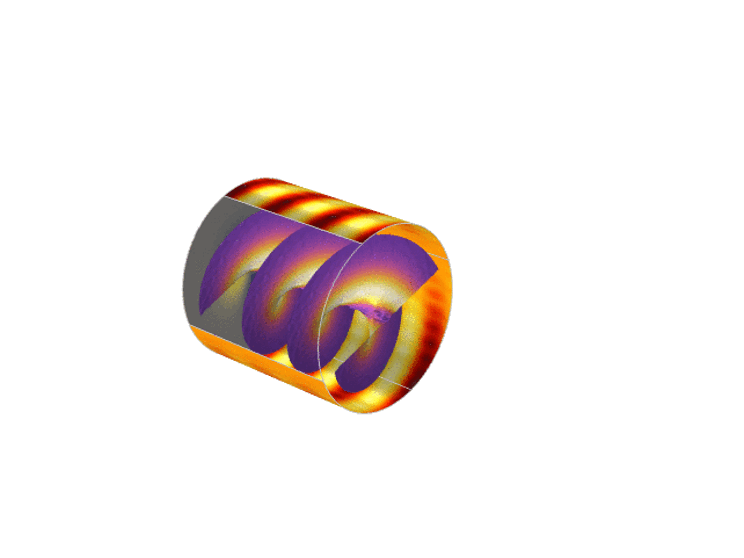
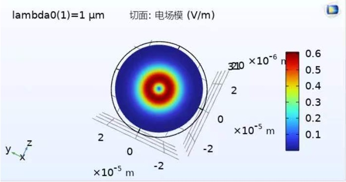
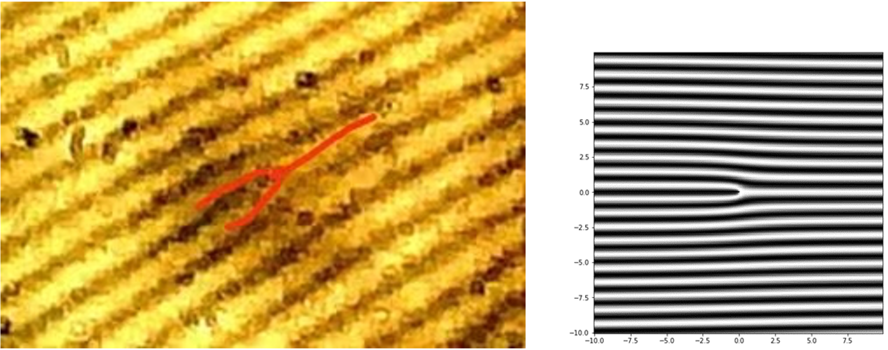

Solar cell
---
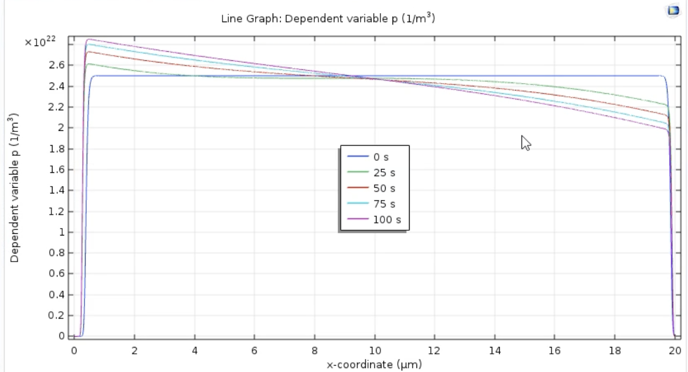
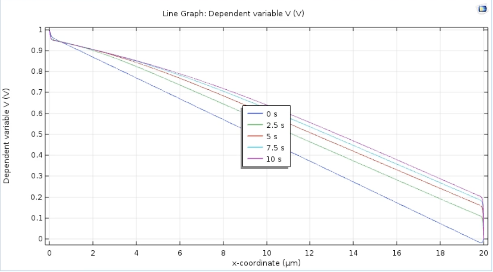

Diffusion-Limited Aggregation (DLA) and Dialetric Breakdown Model (DBM)
---
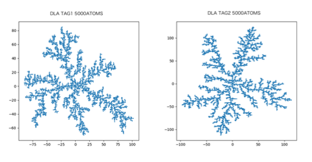
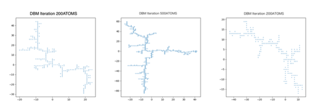

Discrete Fourier Transform (DFT)
---
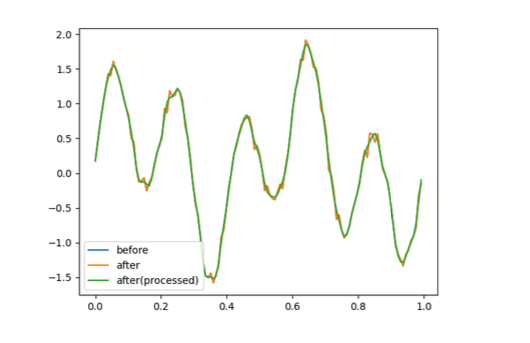

Markov-Chain Monte Carlo (MCMC) Sampling
---
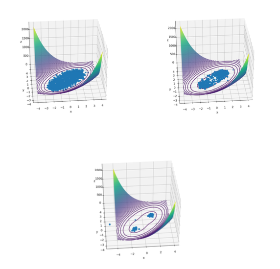

Cubic Spline Interpolation
---
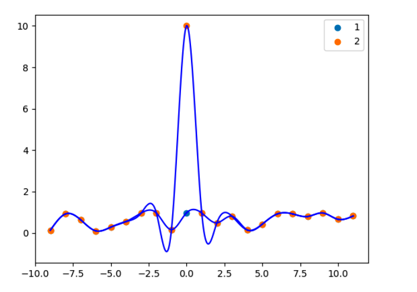

